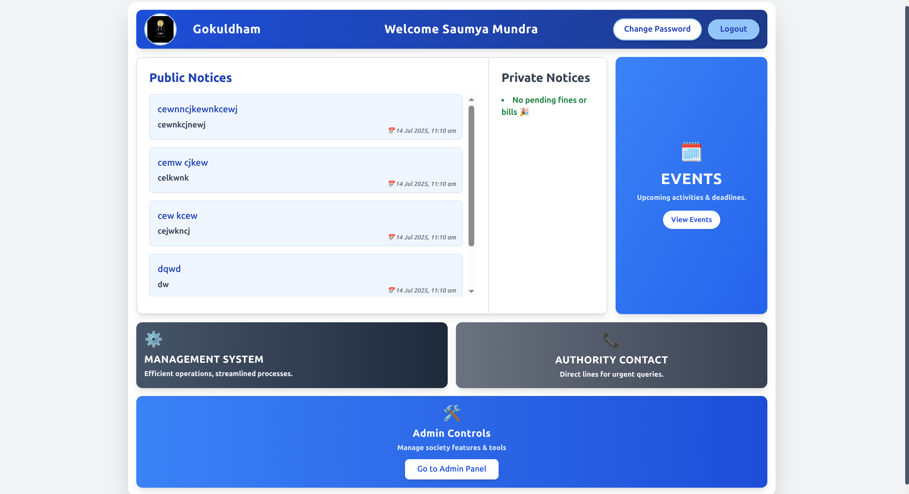

Society Management System(SMS)

A full-stack web application built to manage various aspects of a residential society, including notice management, maintenance tracking, member authentication, complaint handling, and financial oversight and event management.

## 🚀 Features

- 🔐 **Role-Based Authentication**: Secure login/logout functionality for members,secretary and workers using session-based authentication.
- 📢 **Notice Management**: Post and display notices in real-time using MongoDB.
- 🛠️ **Complaint Ticketing System**: Members can raise complaints; workers can view and resolve them.
- 💰 **Financial Management**: Basic ledger or tracking of financial issues.
- 📱 **Responsive UI**: Clean and modern interface using Tailwind CSS, optimized for all screen sizes.

## 🛠️ Tech Stack

- **Frontend**: HTML, Tailwind CSS, JavaScript
- **Backend**: Node.js, Express.js
- **Database**: MongoDB (using Mongoose) using compass locally
- **Session Management**: `express-session`, cookies

## 📁 Project Structure
society-management-system/
├── pages/                             # Static HTML pages
│   ├── addmembers_page.html
│   ├── event_dashboard.html
│   ├── event_dashboard_page.html
│   ├── generate_bills_page.html
│   ├── landing_page.html
│   ├── login_page.html
│   ├── memberlogin_page.html
│   ├── notice_page.html
│   ├── registration_page.html
│   ├── rmsgenerateticket_page.html
│   ├── rmshome_page.html
│   ├── showtickets_page.html
│   └── society.html
│
├── public/                            # Static assets
│   ├── css/
│   └── images/
│
├── src/
│   ├── Databases/
│   │   └── db.js                      # MongoDB connection setup
│   │
│   ├── middlewares/                  # Auth middlewares
│   │   ├── isLoggedIn.js
│   │   └── isSecretary.auth.js
│   │
│   ├── Models/                        # Mongoose schemas
│   │   ├── Createticket.models.js
│   │   ├── Event.models.js
│   │   ├── EventRegistration.models.js
│   │   ├── Fine.models.js
│   │   ├── LostFoundItem.models.js
│   │   ├── Maintenancebills.models.js
│   │   ├── Notice.models.js
│   │   ├── Secreatary.models.js
│   │   ├── Society.models.js
│   │   └── User.models.js
│   │
│   └── routers/
│       └── secretary.routers.js
│
├── views/                             # Server-rendered EJS templates
│   ├── adminpanel.ejs
│   ├── all_fines.ejs
│   ├── allbills.ejs
│   ├── change_member_password.ejs
│   ├── dashboard.ejs
│   ├── event_attendees.ejs
│   ├── event_create.ejs
│   ├── event_list.ejs
│   ├── events_past.ejs
│   ├── fms_dashboard.ejs
│   ├── forgot_password.ejs
│   ├── generate_fine.ejs
│   ├── lnf_dashboard.ejs
│   ├── lnf_list.ejs
│   ├── lnf_post.ejs
│   ├── my_fines.ejs
│   ├── mybills.ejs
│   ├── payment_history.ejs
│   ├── secretary_security_panel.ejs
│   ├── set_password.ejs
│   ├── society.ejs
│   ├── user_bills.ejs
│   └── worker_dashboard.ejs
│
├── .env                               # Environment variables
├── .gitignore
├── app.js                             # Server entry point
├── package.json
├── package-lock.json
└── README.md
##PROJECT IMAGES



## 🔧 Installation

1. **Clone the repository**

```bash
git clone https://github.com/your-username/society-management-system.git
cd society-management-system
```

2. **Install dependencies**

```bash
npm i
```

3.Install all other dependencies used in this project 

```bash
npm install cookie-parser ejs express express-session mongoose postman
  
```


4. **Set up MongoDB**

Make sure you have MongoDB installed locally and use Compass.

Create a `.env` file in the root directory and add:

```env
MONGO_URI=your_mongodb_connection_string
SESSION_SECRET=your_session_secret
PORT=3000
```

5. **Run the application**

```bash
nodemon app.js
```

6. **Open in Browser**

Navigate to: [http://localhost:3000](http://localhost:3000)


## 📬 Feedback & Contributions

Feel free to fork this repo, raise issues, or submit pull requests.  
For feedback or suggestions, contact me via GitHub or email=>mundrasaumya17@gmail.com
